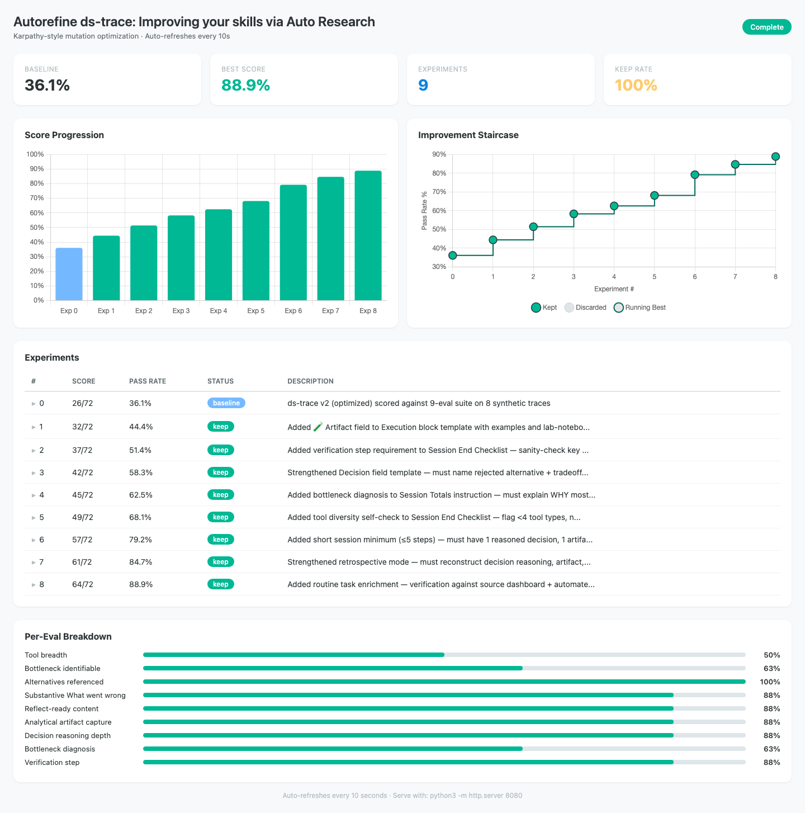

# AutoRefine

**Karpathy's autoresearch + Hamel's Three Gulfs, applied to Claude Code skills.**

A guided pipeline for iteratively improving any skill — from zero evals to optimized and validated. Point it at a skill, and it walks you through design audit, error analysis, and mutation-based optimization with a live dashboard.



## Results

We used autorefine on our own skills:

| Skill | Baseline | Final | Experiments | Kept | Key improvements |
|-------|----------|-------|-------------|------|-----------------|
| ds-trace | 36.1% | 88.9% | 9 | 9/9 (100%) | Artifact capture, verification steps, decision reasoning depth, tool diversity self-check, short session minimum, bottleneck diagnosis |
| ds-review | 85.7% | 100% | 3 | 2/3 (67%) | Location precision rule, severity calibration for prescriptive docs |

**ds-trace detail:** 9 binary evals across 8 synthetic traces. Every experiment improved the score — the staircase in the dashboard shows steady improvement from 36% to 89% with zero discards. Each mutation added one specific instruction to the skill (artifact field, verification step, decision tradeoff, etc.).

## Install

```bash
git clone https://github.com/surahli123/autorefine-skill-improvement.git
cp -r autorefine-skill-improvement/autorefine/ ~/.claude/skills/autorefine/
```

Or copy the 3 core files (`SKILL.md`, `dashboard.html`, `references.md`) directly to `~/.claude/skills/autorefine/`.

## Usage

```
/autorefine path/to/your-skill/
```

The agent detects your progress and picks up where you left off. First run scaffolds a workspace with dashboard, results tracking, and eval templates.

## What It Does

Three gulfs to cross, in order:

```
Gulf 1: Comprehension — What does this skill actually do?
  Phase 1: Design Audit        Score against v2.0 patterns (Gotchas, voice, disclosure)
  Phase 2: Eval Audit           Assess existing evals or document their absence
  Phase 3: Error Analysis       YOU read 20+ outputs and build a failure taxonomy
  >>> Human Gate <<<             Approve taxonomy before proceeding

Gulf 2: Specification — Do our judges measure what matters? (v1.1)
  Phase 4-6: Write + validate automated judges

Gulf 3: Generalization — Does it work on unseen inputs?
  Phase 7: AutoResearch Loop    Mutate → test → keep/discard (Karpathy-style)
```

Phase 3 (error analysis) is human-in-the-loop by design. You cannot automate comprehension.

## The Dashboard

Each autorefine run produces a live dashboard with:

- **Score Progression** — bar chart showing each experiment's pass rate
- **Improvement Staircase** — Karpathy-style scatter + step graph showing the running best score climbing over experiments
- **Expandable experiment details** — click any row to see what changed (type, location, code snippet)
- **Per-eval breakdown** — pass rates for each binary eval

Serve it: `cd autoresearch-<skill>/ && python3 -m http.server 8080`

## Requirements

- **Claude Code** or any compatible coding agent with Read/Write/Bash tools
- Works on agents with limited tool sets — no TaskCreate, Agent, or Skill tool required
- **Optional enhancement:** Install [Hamel's evals-skills](https://github.com/hamelsmu/evals-skills) for deeper eval auditing and judge writing

## How It's Built

3 core files. That's it.

| File | What |
|------|------|
| `SKILL.md` | All instructions inline — orchestrator + phases + gotchas |
| `dashboard.html` | Chart.js dashboard with Karpathy step graph, auto-refreshes every 10s |
| `references.md` | Three Gulfs framework + v2.0 audit rubric, loaded on demand |

Inspired by [Karpathy's autoresearch](https://github.com/karpathy/autoresearch) (the mutation loop), [Hamel Husain's eval methodology](https://hamel.dev) (the Three Gulfs), and [Thariq's skill design patterns](https://www.anthropic.com) (the v2.0 audit).

## Limitations

- **Gulf 2 (Phases 4-6) not yet implemented.** v1.0 covers Gulf 1 + Gulf 3. Judge writing and validation coming in v1.1.
- **Dashboard requires internet** for Chart.js CDN. If your network blocks CDN access, download `chart.umd.min.js` locally.
- **No concurrent sessions.** Don't run two autorefine sessions on the same skill — state.json has no locking.

## License

MIT
